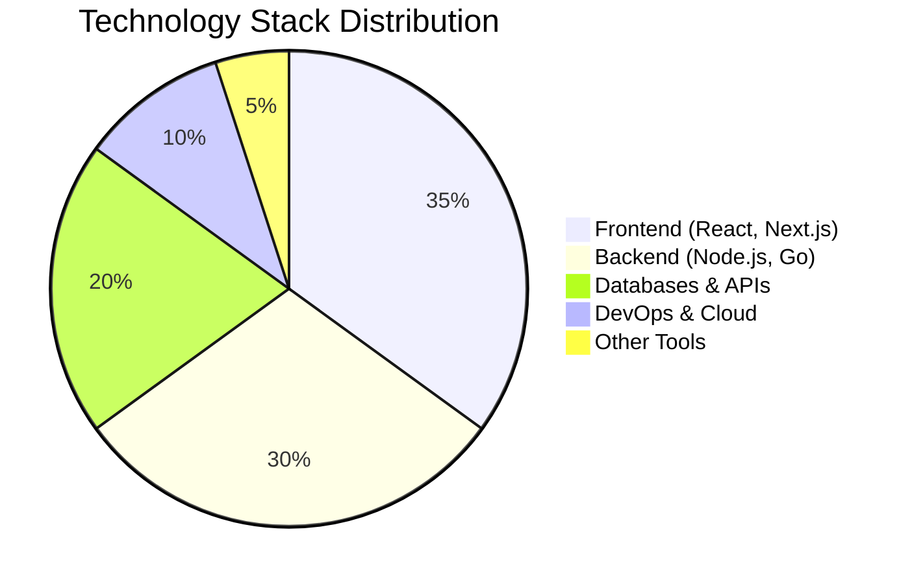

<div align="center">

<!-- Animated 3D Header -->


<!-- Dynamic Typing Animation with Multiple Lines -->
<p align="center">
  <a href="https://git.io/typing-svg">
    
  </a>
</p>

<!-- Enhanced Social Badges with Hover Effects -->
<p align="center">
  <a href="mailto:Worksiddhant18@gmail.com">
    
  </a>
  <a href="https://www.linkedin.com/in/siddhant-jena-457350389">
    
  </a>
  <a href="https://www.instagram.com/s1ddhant._.18/">
    
  </a>
  <a href="https://github.com/FOX-KNIGHT">
    
  </a>
  <a href="https://twitter.com/your-handle">
    
  </a>
</p>

<!-- Enhanced Metrics -->
<p align="center">
  
  
  
</p>

</div>

---

<!-- Animated Divider -->


<!-- Interactive About Me Section -->
## 🎯 About Me

<div align="center">


</div>

```javascript
const siddhant = {
    pronouns: "He" | "Him",
    location: "Bhopal, India 🇮🇳",
    role: "Full Stack Developer",
    company: "Open for Opportunities",
    
    code: {
        languages: ["JavaScript", "TypeScript", "Go", "Python"],
        proficiency: "Intermediate to Advanced"
    },
    
    technologies: {
        frontEnd: {
            frameworks: ["React", "Next.js", "Vue.js"],
            styling: ["Tailwind CSS", "Bootstrap", "Sass", "Material-UI"],
            stateManagement: ["Redux", "Zustand", "Context API"]
        },
        backEnd: {
            nodeJs: ["Express", "Nest.js", "Fastify"],
            go: ["Gin", "Fiber", "Echo"],
            python: ["FastAPI", "Flask"]
        },
        databases: {
            sql: ["PostgreSQL", "MySQL"],
            noSQL: ["MongoDB", "Redis"],
            orm: ["Prisma", "TypeORM", "Mongoose"]
        },
        devOps: {
            containerization: ["Docker", "Docker Compose"],
            ciCd: ["GitHub Actions", "GitLab CI"],
            cloud: ["AWS", "Vercel", "Netlify"]
        },
        tools: ["VS Code", "Postman", "Figma", "Git", "Linux"]
    },
    
    currentlyLearning: ["Microservices", "System Design", "Kubernetes"],
    currentFocus: "Building scalable, performant web applications",
    
    funFacts: [
        "I debug with console.log() 🐛",
        "Coffee is my primary fuel ☕️",
        "Night owl developer 🦉",
        "Love solving complex problems 🧩"
    ],
    
    openToWork: true,
    lookingFor: "Full-time opportunities in Full Stack Development"
};
```

<br clear="right"/>

---

<!-- Animated Divider -->


<!-- Enhanced Tech Stack with Categories -->
## 🛠️ Tech Stack & Expertise

<div align="center">

### 💻 Programming Languages
<p>
  <a href="https://skillicons.dev">
    
  </a>
</p>

### 🎨 Frontend Development
<p>
  <a href="https://skillicons.dev">
    
  </a>
</p>

### ⚙️ Backend & Databases
<p>
  <a href="https://skillicons.dev">
    
  </a>
</p>

### 🔧 DevOps & Tools
<p>
  <a href="https://skillicons.dev">
    
  </a>
</p>

</div>

---

<!-- Animated Divider -->


<!-- Enhanced GitHub Stats with Multiple Visualizations -->
## 📊 GitHub Analytics & Performance

<div align="center">

<!-- Main Stats Row -->
<p>
  
  
</p>

<!-- Language Stats & Activity Graph -->
<p>
  
  
</p>

<!-- Trophy Collection -->
<p>
  
</p>

</div>

---

<!-- Animated Divider -->


<!-- Detailed Contribution Graph -->
## 📈 Contribution Timeline

<div align="center">

<!-- Activity Graph -->


<!-- Productivity Stats -->


</div>

---

<!-- Animated Divider -->


<!-- Code Time Stats (WakaTime Integration) -->
## ⏱️ Coding Activity & Time Stats

<div align="center">

<!--START_SECTION:waka-->
<!--END_SECTION:waka-->

<!-- Coding Stats Cards -->
<p>
  
</p>

</div>

---

<!-- Animated Divider -->


<!-- Featured Projects with Enhanced Cards -->
## 🚀 Featured Projects & Repositories

<div align="center">

<table>
  <tr>
    <td width="50%">
      <h3 align="center">Project 1</h3>
      <div align="center">  
        <a href="https://github.com/FOX-KNIGHT/project-1">
          
        </a>
        <br>
        <br>
        <p>
          <a href="https://github.com/FOX-KNIGHT/project-1" target="_blank">
            
          </a>  
          <a href="https://demo-link.com" target="_blank">
            
          </a>
        </p>
        <p><strong>JavaScript, React, Node.js</strong> - Brief project description highlighting key features and technologies used.</p>
      </div>
    </td>
    <td width="50%">
      <h3 align="center">Project 2</h3>
      <div align="center">  
        <a href="https://github.com/FOX-KNIGHT/project-2">
          
        </a>
        <br>
        <br>
        <p>
          <a href="https://github.com/FOX-KNIGHT/project-2" target="_blank">
            
          </a>  
          <a href="https://demo-link.com" target="_blank">
            
          </a>
        </p>
        <p><strong>Go, PostgreSQL, Docker</strong> - Brief project description highlighting key features and technologies used.</p>
      </div>
    </td>
  </tr>
  <tr>
    <td width="50%">
      <h3 align="center">Project 3</h3>
      <div align="center">  
        <a href="https://github.com/FOX-KNIGHT/project-3">
          
        </a>
        <br>
        <br>
        <p>
          <a href="https://github.com/FOX-KNIGHT/project-3" target="_blank">
            
          </a>  
          <a href="https://demo-link.com" target="_blank">
            
          </a>
        </p>
        <p><strong>Next.js, TypeScript, MongoDB</strong> - Brief project description highlighting key features and technologies used.</p>
      </div>
    </td>
    <td width="50%">
      <h3 align="center">Project 4</h3>
      <div align="center">  
        <a href="https://github.com/FOX-KNIGHT/project-4">
          
        </a>
        <br>
        <br>
        <p>
          <a href="https://github.com/FOX-KNIGHT/project-4" target="_blank">
            
          </a>  
          <a href="https://demo-link.com" target="_blank">
            
          </a>
        </p>
        <p><strong>Python, FastAPI, Redis</strong> - Brief project description highlighting key features and technologies used.</p>
      </div>
    </td>
  </tr>
</table>

<p>
  <a href="https://github.com/FOX-KNIGHT?tab=repositories">
    
  </a>
</p>

</div>

---

<!-- Animated Divider -->


<!-- Recent GitHub Activity -->
## ⚡ Recent GitHub Activity

<div align="center">

<!--START_SECTION:activity-->
<!--END_SECTION:activity-->

</div>

---

<!-- Animated Divider -->


<!-- Achievements & Certifications -->
## 🏆 Achievements & Certifications

<div align="center">

<details open>
<summary><b>🎓 Certifications</b></summary>
<br>

| Certificate | Platform | Year |
|-------------|----------|------|
| 📜 **Full Stack Web Development** | freeCodeCamp | 2024 |
| 📜 **JavaScript Algorithms & Data Structures** | freeCodeCamp | 2024 |
| 📜 **Node.js - The Complete Guide** | Udemy | 2024 |
| 📜 **Go Programming Language** | Coursera | 2024 |
| 📜 **Docker & Kubernetes** | Udemy | 2024 |

</details>

<details open>
<summary><b>🌟 Achievements</b></summary>
<br>

- 🥇 **Top Contributor** - Contributed to 10+ open source projects
- 🚀 **Project Launch** - Successfully deployed 15+ production applications
- 💡 **Problem Solver** - Solved 200+ coding challenges on LeetCode
- 🤝 **Collaboration** - Worked with teams across 3+ countries
- 📚 **Knowledge Sharing** - Written 10+ technical blog posts

</details>

</div>

---

<!-- Animated Divider -->


<!-- Blog Posts -->
## 📝 Latest Blog Posts

<div align="center">

<!-- BLOG-POST-LIST:START -->
<!-- BLOG-POST-LIST:END -->

<p>
  <a href="https://your-blog-link.com">
    
  </a>
</p>

</div>

---

<!-- Animated Divider -->


<!-- Skills Breakdown -->
## 💼 Professional Skills Breakdown

<div align="center">



### Skill Proficiency Levels

| Skill Category | Technologies | Proficiency |
|----------------|--------------|-------------|
| **Frontend** | React, Next.js, TypeScript | ████████░░ 80% |
| **Backend** | Node.js, Express, Go | ███████░░░ 75% |
| **Databases** | MongoDB, PostgreSQL | ███████░░░ 70% |
| **DevOps** | Docker, Git, CI/CD | ██████░░░░ 65% |
| **Cloud** | AWS, Vercel, Netlify | ██████░░░░ 60% |

</div>

---

<!-- Animated Divider -->


<!-- Fun Facts & Interests -->
## 🎮 Beyond Coding

<div align="center">

<table>
  <tr>
    <td width="50%">
      
### 🎯 Interests
- 🎮 Gaming (Strategy & RPG)
- 📚 Reading Tech Blogs & Documentation
- 🎵 Music Production & Listening
- 🏃‍♂️ Fitness & Running
- 🌍 Exploring New Technologies
      
    </td>
    <td width="50%">
      
### 💡 Fun Facts
- ☕ Coffee consumption: ~4 cups/day
- 🌙 Peak productivity: 10 PM - 2 AM
- 🐛 Debugging method: console.log() + coffee
- 📊 Code/life balance: Still working on it
- 🎯 Favorite quote: "Make it work, make it right, make it fast"
      
    </td>
  </tr>
</table>

</div>

---

<!-- Animated Divider -->


<!-- GitHub Activity Snake -->
## 🐍 Contribution Snake

<div align="center">

<picture>
  <source media="(prefers-color-scheme: dark)" srcset="https://raw.githubusercontent.com/FOX-KNIGHT/FOX-KNIGHT/output/github-contribution-grid-snake-dark.svg">
  <source media="(prefers-color-scheme: light)" srcset="https://raw.githubusercontent.com/FOX-KNIGHT/FOX-KNIGHT/output/github-contribution-grid-snake.svg">
  
</picture>

</div>

---

<!-- Animated Divider -->


<!-- Support Section -->
## ☕ Support My Work

<div align="center">

If you like my work and want to support me, you can buy me a coffee! ☕

<p>
  <a href="https://www.buymeacoffee.com/yourusername">
    
  </a>
  <a href="https://ko-fi.com/yourusername">
    
  </a>
</p>

</div>

---

<!-- Animated Divider -->


<!-- Motivational Quote -->
## 💬 Developer Quote of the Day

<div align="center">


</div>

---

<!-- Animated Divider -->


<!-- Let's Connect Section -->
## 🤝 Let's Connect & Collaborate

<div align="center">

<p>
  <i>✨ I'm always excited to collaborate on innovative projects and connect with fellow developers! ✨</i>
  <br><br>
  <i>💼 Open to freelance opportunities and full-time positions</i>
  <br>
  <i>🌟 Let's build something amazing together!</i>
</p>

<br>

### 📬 Reach Out To Me

<p>
  <a href="mailto:Worksiddhant18@gmail.com">
    
  </a>
  <a href="https://www.linkedin.com/in/siddhant-jena-457350389">
    
  </a>
  <a href="https://twitter.com/your-handle">
    
  </a>
  <a href="https://discord.gg/your-server">
    
  </a>
</p>

<br>

### 🌐 Find Me Around the Web

<p>
  <a href="https://dev.to/your-username">
    
  </a>
  <a href="https://medium.com/@your-username">
    
  </a>
  <a href="https://stackoverflow.com/users/your-id">
    
  </a>
  <a href="https://leetcode.com/your-username">
    
  </a>
</p>

</div>

---

<!-- Footer Wave -->
<div align="center">

<!-- Visitor Count -->
<p>
  
</p>

<!-- Closing Message -->
<p>
  <i>⭐️ From <a href="https://github.com/FOX-KNIGHT">FOX-KNIGHT</a> with ❤️</i>
  <br>
  <i>Made with 💻, ☕, and a lot of 🎵</i>
</p>


</div>

<!-- Easter Egg: Animated Bottom Text -->
<div align="center">
  
</div>  </a>
</p>

---

<!-- GitHub Stats Section -->
## 📊 GitHub Statistics

<p align="center">
  
  
</p>

<p align="center">
  
  
</p>

<!-- Trophy Section -->
<p align="center">
  
</p>

---

<!-- Activity Graph -->
## 📈 Contribution Graph

<p align="center">
  
</p>

---

<!-- Current Projects Section -->
## 🚀 Featured Projects

<p align="center">
  <a href="https://github.com/FOX-KNIGHT?tab=repositories">
    
  </a>
  <a href="https://github.com/FOX-KNIGHT?tab=repositories">
    
  </a>
</p>

---

<!-- Coding Activity -->
## âš¡ Recent Activity

<!--START_SECTION:activity-->
<!--END_SECTION:activity-->

---

<!-- Skills Metrics -->
## 📌 Skills & Expertise

<p align="center">
  
</p>

<details>
<summary><b>🎓 Certifications & Achievements</b></summary>
<br/>

- 🏆 **Achievement 1** - Description
- 🏆 **Achievement 2** - Description
- 🏆 **Achievement 3** - Description
- 📜 **Certification 1** - Platform
- 📜 **Certification 2** - Platform

</details>

<details>
<summary><b>💡 Fun Facts</b></summary>
<br/>

- 🎮 Gamer in free time
- 📚 Continuous learner
- ☕ Powered by coffee
- 🌙 Night owl developer
- 🎵 Code with music

</details>

---

<!-- Snake Animation -->
## 🐍 Contribution Snake

<picture>
  <source media="(prefers-color-scheme: dark)" srcset="https://raw.githubusercontent.com/FOX-KNIGHT/FOX-KNIGHT/output/github-contribution-grid-snake-dark.svg">
  <source media="(prefers-color-scheme: light)" srcset="https://raw.githubusercontent.com/FOX-KNIGHT/FOX-KNIGHT/output/github-contribution-grid-snake.svg">
  
</picture>

---

<!-- Quote Section -->
<p align="center">
  
</p>

---

<!-- Connect Section -->
## 🤝 Let's Connect

<p align="center">
  <i>I'm always interested in collaborating on innovative projects and connecting with fellow developers!</i>
  <br/><br/>
  <a href="mailto:Worksiddhant18@gmail.com">
    
  </a>
  <a href="https://www.linkedin.com/in/siddhant-jena-457350389">
    
  </a>
</p>

---

<!-- Footer Wave -->


</div>

<!-- Visitor Badge (Hidden but tracked) -->
<p align="center">
  
</p>
